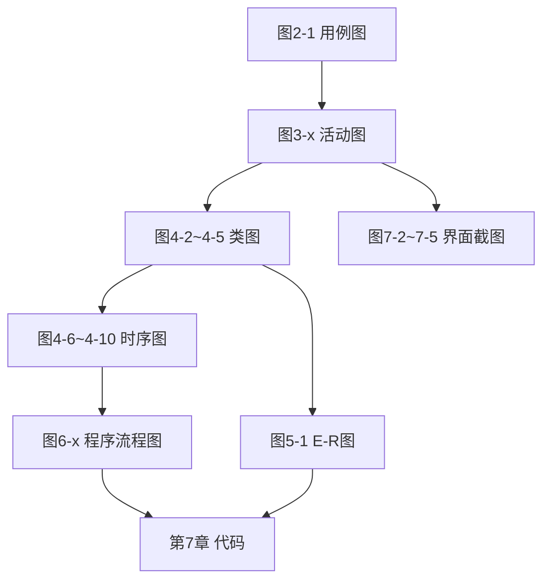

# 股票数据管理分析系统 — 设计提交文档模板（含篇幅与图表阐述规范）

> **用途**：学年设计 / 课程设计正式设计说明书（先设计、后开发）  
> **适用课题**：股票数据管理分析系统（5 人小组）  
> **建议全文篇幅**：正文约 **1.5 万～2.5 万字**（不含附录源码；图表约 25～35 幅）  
> **排版（定稿 Word）**：正文宋体小四；英文 Times New Roman 小四；首行缩进 2 字符；单倍行距  

---

## 使用说明（提交前删除本章）

1. 下文 **「须阐述」** 的图/表：图题下方必须有文字说明，不能只贴图。  
2. 标注 **【示例】** 的句子可改写进正文，勿照抄与本系统无关的内容。  
3. 字数均为 **汉字约数**（含标点），表格单元格字数不计入正文。  
4. 定稿时删除所有 `>` 引用块中的「撰写指引」标题，保留正式正文。  

---

## 图表阐述通用规范（全篇适用）

| 图/表类型 | 是否须正文阐述 | 图前文字 | 图后阐述写什么 | 单张建议字数 |
|-----------|----------------|----------|----------------|--------------|
| **用例图** | ✅ 必须 | 1～2 句引出「见图 x-x」 | 参与者是谁；边界内有哪些用例包；**每个用例对应第 3 章哪张活动图** | **250～400** |
| **活动图** | ✅ 必须 | 说明要解决的业务问题 | 泳道含义；主路径步骤 3～5 条；分支/异常 1～2 条；**与上一章哪张用例图对应** | **300～500** |
| **架构图/模块图** | ✅ 必须 | — | 各层/模块职责；与五人分工如何对应；数据流向 | **200～350** |
| **类图** | ✅ 必须 | — | 有哪些核心类；类间 1:n 等关系；**由哪张活动图提炼**；不展开方法体 | **250～400** |
| **时序图** | ✅ 必须 | — | 参与对象列表；调用顺序 4～6 步；**对应活动图哪几步**；**哪条消息对应第 6 章哪张流程图** | **300～450** |
| **E-R 图** | ✅ 必须 | — | 实体与联系；与类图实体是否一致；主键策略 | **200～350** |
| **字段说明表** | ✅ 必须 | — | 选 1～2 张核心表文字说明设计理由；其余表可仅列表 | 每表 **80～150** |
| **程序流程图** | ✅ 必须 | 必须写清对应**函数名** | 输入输出变量类型；每个判断框条件；循环/异常；**能对应到哪段代码文件** | **350～600** |
| **界面截图** | ✅ 必须 | — | 界面名称；实现了第 3 章哪条流程；主要控件作用；与流程图一致性 | 每张 **150～250** |
| **测试用例表** | ⚠️ 简述 | — | 覆盖哪些 FR；通过率一句话 | **100～200** |
| **分工表/环境表** | 可选 | — | 一两句说明即可 | **50～100** |

**图序写法示例【示例】**：  
「用户发起筛选请求后，后端依次完成参数解析、数据库查询与结果封装，其时序关系如图 4-8 所示。」  
（图 4-8）  
「图 4-8 中，UI 通过 `GET /api/v1/screener` 调用 ScreenerService……该消息链在 6.6 节由图 6-6 进一步细化。」

---

# 摘要

| 项目 | 内容 |
|------|------|
| **写什么** | 系统背景一句、七大功能一句、技术路线一句、完成度一句；不出现「首先、其次」空话 |
| **建议篇幅** | **300～450 字**；英文摘要与之对应 **200～350 词** |
| **图表** | 无 |

**【示例】** 本文设计并实现了一套股票数据管理分析系统，完成行情采集、多源数据清洗入库、数据库持久化、Windows 终端与 Web 界面展示、涨跌幅预警及个人自选管理等功能……

**关键词（3～5 个）**：股票数据；网络爬虫；数据库；智能提醒；Windows 应用  

---

# 1 绪论

| 项目 | 内容 |
|------|------|
| **本章写什么** | 交代「为什么做」「做什么」「谁来做」「文档怎么读」；**不画 UML、不写代码** |
| **本章建议总篇幅** | **1200～1800 字** |

## 1.1 研究背景与意义

| 项目 | 内容 |
|------|------|
| **写什么** | A 股数据分散、个人管理需求；本地系统意义；软件工程「先设计后编码」 |
| **建议篇幅** | **400～600 字** |
| **图表** | 无（可选表 1-1 同类系统对比，若有则 **150 字** 说明） |

**【示例】** 东方财富、新浪等站点字段口径不一致，投资者若仅依赖单一源，难以建立统一的筛选与复盘体系……

## 1.2 课题任务与目标

| 项目 | 内容 |
|------|------|
| **写什么** | 逐条列出任务书 7 项功能；每条写「本系统目标状态」；可写 1 句范围外内容（如不做实盘交易） |
| **建议篇幅** | **500～700 字** |
| **图表** | 无 |

**【示例】** （1）网络爬虫：每日收盘后获取行情，并尽可能补充涨停名单；（2）数据处理：统一 PE、收盘价等字段单位……

## 1.3 小组分工与协作方式

| 项目 | 内容 |
|------|------|
| **写什么** | 5 人对应 5 模块；交付物（章节+图）；联调时间；Git/接口约定；设计人与开发人关系 |
| **建议篇幅** | **400～600 字** |
| **图表** | 表 1-1（见下） |

| 图表 | 须阐述 | 阐述内容与字数 |
|------|--------|----------------|
| **表 1-1** 小组成员分工表 | 建议 | 说明各列含义；点名接口对接人；**80～120 字** |

**表 1-1 列建议**：姓名 | 模块 | 负责章节 | 主要图表编号 | 对接人  

## 1.4 文档组织结构

| 项目 | 内容 |
|------|------|
| **写什么** | 用 1 段话概括第 2～9 章；**必须写出**用例→活动→类/时序→流程图→实现的链条 |
| **建议篇幅** | **300～450 字** |
| **图表** | 可选「图 0-1 图表承接关系」（见文末 Mermaid，**150 字** 说明） |

---

# 2 需求分析

| 项目 | 内容 |
|------|------|
| **本章写什么** | 从用户角度定义系统「要做什么」；产出**用例图**；**不写类、不写 SQL、不写界面像素** |
| **本章建议总篇幅** | **2500～3500 字**（含图后阐述） |

## 2.1 用户角色与使用场景

| 项目 | 内容 |
|------|------|
| **写什么** | 2～3 个角色；每角色 2 个典型场景（谁、何时、要完成什么） |
| **建议篇幅** | **400～550 字** |
| **图表** | 无 |

**【示例】** 角色一：个人投资者——收盘后查看自选股涨跌并调整预警阈值。角色二：系统维护者——手动触发数据同步并查看日志……

## 2.2 功能性需求

| 项目 | 内容 |
|------|------|
| **写什么** | FR-01～FR-07 与任务书一一对应；每条：名称、描述、输入、输出、验收标准 |
| **建议篇幅** | 正文 **500～700 字** + 表 |
| **图表** | 表 2-1 |

| 图表 | 须阐述 | 阐述内容与字数 |
|------|--------|----------------|
| **表 2-1** 功能性需求列表 | ✅ | 说明优先级划分原则；指出 FR-04/FR-05 与界面、提醒的对应；**100～150 字** |

**【示例行】** FR-05 | 智能提醒 | 用户设置日内涨跌幅≥5% | 阈值、股票代码 | 通知记录 | 触发后 1 分钟内可在界面看到提醒  

## 2.3 非功能性需求

| 项目 | 内容 |
|------|------|
| **写什么** | 性能、可靠性、安全性、可维护性；尽量量化（如「全量同步&lt;10 分钟」） |
| **建议篇幅** | **350～500 字** |
| **图表** | 表 2-2（可选） |

| 图表 | 须阐述 | 阐述内容与字数 |
|------|--------|----------------|
| **表 2-2** 非功能性需求 | 可选 | **60～100 字** |

## 2.4 用例分析

| 项目 | 内容 |
|------|------|
| **写什么** | 系统边界；参与者；用例列表；**每个用例指明在第 3 章哪一节展开** |
| **建议篇幅** | 正文 **400～600 字** + 图后阐述 |
| **图表** | 图 2-1（必），图 2-2（可选） |

| 图表 | 须阐述 | 阐述内容与字数 |
|------|--------|----------------|
| **图 2-1** 系统总体用例图 | ✅ 必须 | 见「图表阐述通用规范」；**必须列表**：用例「浏览股票」→3.4，「采集数据」→3.2…… **300～400 字** |
| **图 2-2** 子系统用例图 | 若画则必须 | 说明从图 2-1 哪部分拆分；**200～300 字** |

**【图 2-1 应包含的用例名示例】** 采集行情数据、定时更新、清洗与分类、浏览与筛选股票、设置预警、管理自选与复盘、查询历史数据（可按本组实际增删）。

---

# 3 系统分析（业务流程）

| 项目 | 内容 |
|------|------|
| **本章写什么** | 用**活动图**描述「怎么做业务」；是类图、时序图、流程图的直接来源 |
| **本章建议总篇幅** | **4500～6000 字**（6 张活动图 + 阐述 + 本章小结） |

**本章开篇段（必写，约 200 字）**：说明本章与第 2 章关系——图 2-1 中每个用例在本章细化为一组活动。

## 3.1 系统总体业务流程

| 项目 | 内容 |
|------|------|
| **写什么** | 端到端：爬取→清洗→入库→展示→预警→个人管理；与定时任务关系 |
| **建议篇幅** | **450～650 字** + 图后阐述 |
| **图表** | 图 3-1（必） |

| 图表 | 须阐述 | 阐述内容与字数 |
|------|--------|----------------|
| **图 3-1** 系统总体业务活动图 | ✅ | **基于图 2-1 全部用例**；泳道至少：用户、前端、后端、爬虫、DB、调度器；主路径 5～8 步；**350～500 字** |

## 3.2 网络爬虫与定时采集流程

| 项目 | 内容 |
|------|------|
| **写什么** | 手动 `sync_data` 与 cron 两路径；失败重试；写库；对应 FR-01、FR-07 |
| **建议篇幅** | **400～550 字** |
| **图表** | 图 3-2 |

| 图表 | 须阐述 | 阐述内容与字数 |
|------|--------|----------------|
| **图 3-2** 数据采集活动图 | ✅ | 对应图 2-1「采集/定时更新」；分叉：手动/自动；→ 图 4-3、4-6、6-1；**300～450 字** |

**【示例步骤】** 调度器触发 → 选择数据源 → 请求行情 → 解析 JSON → 写入 `stock_daily` → 更新 `sync_meta`。

## 3.3 数据处理与分类流程

| 项目 | 内容 |
|------|------|
| **写什么** | 多源字段对齐、单位换算、去重、分类规则命中；对应 FR-02 |
| **建议篇幅** | **400～550 字** |
| **图表** | 图 3-3 |

| 图表 | 须阐述 | 阐述内容与字数 |
|------|--------|----------------|
| **图 3-3** 数据清洗与分类活动图 | ✅ | 对应 FR-02；写清「自定义分类」在流程哪一步判断；→ 图 4-4、4-7、6-3；**300～450 字** |

## 3.4 数据展示与分类浏览流程（界面业务主节）

| 项目 | 内容 |
|------|------|
| **写什么** | 用户打开界面→加载列表→选分类/筛选项→查看详情；含终端启动可选路径；对应 FR-04 |
| **建议篇幅** | **500～700 字**（界面相关可略多） |
| **图表** | 图 3-4 |

| 图表 | 须阐述 | 阐述内容与字数 |
|------|--------|----------------|
| **图 3-4** 股票查询与分类展示活动图 | ✅ | 对应 FR-04；**界面展示的业务设计放本节**；→ 图 4-8、6-6、7.2.1 截图；**350～500 字** |

**【示例】** 用户在主界面选择「行业=银行」后，前端请求筛选接口，后端查询 `stock_basic` 与 `stock_daily` 联结结果并分页返回……

## 3.5 智能提醒业务流程

| 项目 | 内容 |
|------|------|
| **写什么** | 配置规则→轮询/检测行情→比较阈值→写入通知；对应 FR-05；**不写「实时」除非已实现** |
| **建议篇幅** | **400～550 字** |
| **图表** | 图 3-5 |

| 图表 | 须阐述 | 阐述内容与字数 |
|------|--------|----------------|
| **图 3-5** 行情预警活动图 | ✅ | 阈值类型示例（如 `day_pct≥5`）；→ 图 4-9、6-8；**300～450 字** |

## 3.6 个人管理业务流程

| 项目 | 内容 |
|------|------|
| **写什么** | 加自选、写备注、标重要程度、写复盘；增删改查；对应 FR-06 |
| **建议篇幅** | **400～550 字** |
| **图表** | 图 3-6 |

| 图表 | 须阐述 | 阐述内容与字数 |
|------|--------|----------------|
| **图 3-6** 个人管理活动图 | ✅ | 每个活动对应未来表 `watchlist`/`review_log`；→ 图 4-10、6-10、6-11；**300～450 字** |

## 3.7 本章小结（建议新增小节）

| 项目 | 内容 |
|------|------|
| **写什么** | 用表格列出：活动图编号 → 第 4 章类/时序 → 第 6 章流程图 |
| **建议篇幅** | **250～400 字** + 表 3-1 |

| 图表 | 须阐述 | 阐述内容与字数 |
|------|--------|----------------|
| **表 3-1** 活动图与后续设计承接表 | ✅ | **150～200 字** |

---

# 4 系统设计（结构建模）

| 项目 | 内容 |
|------|------|
| **本章写什么** | 静态结构（类图、架构）+ 动态协作（时序图）；**仍不写代码实现细节** |
| **本章建议总篇幅** | **5500～7500 字** |

## 4.1 系统总体架构设计

| 项目 | 内容 |
|------|------|
| **写什么** | 表现层/业务层/数据层/采集层；技术选型一句话；与图 3-1 一致 |
| **建议篇幅** | **500～700 字** |
| **图表** | 图 4-1、表 4-1 |

| 图表 | 须阐述 | 阐述内容与字数 |
|------|--------|----------------|
| **图 4-1** 逻辑架构图 | ✅ | 承接图 3-1；五模块与五人分工；**250～350 字** |
| **表 4-1** 模块与分工 | 建议 | **80～120 字** |

## 4.2 领域类图设计

| 项目 | 内容 |
|------|------|
| **写什么** | 从活动图名词抽类；写属性名+类型；关联与多重性；**不写方法实现** |
| **建议篇幅** | 每子节 **350～500 字** |
| **图表** | 图 4-2～4-5 |

| 图表 | 须阐述 | 阐述内容与字数 |
|------|--------|----------------|
| **图 4-2** 核心领域类图 | ✅ | 基于图 3-1；列出 Stock、User、Watchlist 等；**300～400 字** |
| **图 4-3** 采集子系统类图 | ✅ | 基于图 3-2；**250～350 字** |
| **图 4-4** 数据处理类图 | ✅ | 基于图 3-3；**250～350 字** |
| **图 4-5** 提醒与个人管理类图 | ✅ | 基于图 3-5、3-6；**250～350 字** |

## 4.3 关键业务时序图设计

| 项目 | 内容 |
|------|------|
| **写什么** | 每条业务链 1 张时序图；消息名与 API 一致；返回对象说明 |
| **建议篇幅** | 每张图配套 **350～500 字** |
| **图表** | 图 4-6～4-10 |

| 图表 | 须阐述 | 阐述内容与字数 |
|------|--------|----------------|
| **图 4-6** 采集时序图 | ✅ | 图 3-2 + 图 4-3；消息链 5～8 条；→ 6-1、6-2；**300～450 字** |
| **图 4-7** 清洗入库时序图 | ✅ | 图 3-3 + 图 4-4；→ 6-3；**300～450 字** |
| **图 4-8** 查询展示时序图 | ✅ | **界面主时序**；图 3-4；UI→API→Service→DB；→ 6-6；**350～500 字** |
| **图 4-9** 预警时序图 | ✅ | 图 3-5；→ 6-8、6-9；**300～450 字** |
| **图 4-10** 个人管理时序图 | ✅ | 图 3-6；→ 6-10、6-11；**300～450 字** |

## 4.4 接口与模块协作设计

| 项目 | 内容 |
|------|------|
| **写什么** | 主要 REST/CLI 列表；谁实现；对应哪张时序图 |
| **建议篇幅** | **400～600 字** |
| **图表** | 表 4-2 主要接口表（避免与表 4-1 重号，模板原表 4-1 若已用于分工，接口表改用 4-2） |

| 图表 | 须阐述 | 阐述内容与字数 |
|------|--------|----------------|
| **表 4-2** API/CLI 接口表 | ✅ | 选 3 个核心接口文字解释参数；**150～250 字** |

---

# 5 数据库设计

| 项目 | 内容 |
|------|------|
| **本章写什么** | 把类图落地为 E-R 与表结构；字段与爬虫来源对应 |
| **本章建议总篇幅** | **3000～4500 字** |

## 5.1 概念结构设计

| 项目 | 内容 |
|------|------|
| **写什么** | 实体、联系、基数；与图 4-2 实体一致 |
| **建议篇幅** | **350～500 字** |
| **图表** | 图 5-1 |

| 图表 | 须阐述 | 阐述内容与字数 |
|------|--------|----------------|
| **图 5-1** E-R 图 | ✅ | 与图 4-2 对照；说明联系 1:n；**250～350 字** |

## 5.2 逻辑结构设计

| 项目 | 内容 |
|------|------|
| **写什么** | 第三范式说明；主外键；索引；核心表逐字段说明 |
| **建议篇幅** | **800～1200 字**（表多时可把长表放附录） |
| **图表** | 表 5-1、表 5-2～5-n |

| 图表 | 须阐述 | 阐述内容与字数 |
|------|--------|----------------|
| **表 5-1** 数据表清单 | ✅ | **100～150 字** |
| **表 5-2** `stock_daily` 等核心表 | ✅ 每张核心表 | 字段含义+爬虫来源列；**每张 80～150 字** |
| 其余表 | 可仅列表 | 总计 **200～300 字** 概括 |

**【示例字段行】** `close` | DECIMAL(10,2) | 收盘价 | 新浪 `close` 字段，单位元  

## 5.3 物理设计与存储策略

| 项目 | 内容 |
|------|------|
| **写什么** | SQLite/MySQL 选型理由；备份周期；数据量估算 |
| **建议篇幅** | **350～500 字** |
| **图表** | 图 5-2 部署图（可选） |

| 图表 | 须阐述 | 阐述内容与字数 |
|------|--------|----------------|
| **图 5-2** 数据库部署图 | 若画则必须 | **150～250 字** |

---

# 6 详细设计（程序流程图）

| 项目 | 内容 |
|------|------|
| **本章写什么** | **方法级**逻辑；任何人能按图写代码；与第 7 章函数一一对应 |
| **本章建议总篇幅** | **5000～7000 字**（全篇最重设计章之一） |

## 6.1 程序流程图绘制规范

| 项目 | 内容 |
|------|------|
| **写什么** | 本组符号标准；禁止「存库」「验证」空话；命名与代码文件一致 |
| **建议篇幅** | **400～600 字** |
| **图表** | 表 6-1 流程图↔代码对照 |

| 图表 | 须阐述 | 阐述内容与字数 |
|------|--------|----------------|
| **表 6-1** 流程图与代码对照 | ✅ | **120～180 字** |

**【反例】** 「把数据存入数据库」→ **正例**「`INSERT INTO stock_daily (code, trade_date, close) VALUES (:code, :d, :c)`」

## 6.2 数据采集模块详细设计

| 项目 | 内容 |
|------|------|
| **建议篇幅** | 每图 **400～600 字**（含图后阐述） |
| **图表** | 图 6-1、6-2 |

| 图表 | 须阐述 | 阐述内容与字数 |
|------|--------|----------------|
| **图 6-1** `fetch_daily_quotes()` | ✅ | 变量 `raw: dict`；HTTP 异常分支；→ `data_sync.py`；**400～550 字** |
| **图 6-2** `scheduler_daily_job()` | ✅ | `is_trading_day: bool`；写 `sync_meta` 字段；**350～500 字** |

## 6.3 数据解析与清洗模块详细设计

| 图表 | 须阐述 | 阐述内容与字数 |
|------|--------|----------------|
| **图 6-3** `normalize_record()` | ✅ | 字段映射表引用表 5-2；**400～550 字** |
| **图 6-4** `apply_user_category()` | ✅ | 规则 `category_id` 匹配；**350～500 字** |

## 6.4 数据库访问模块详细设计

| 图表 | 须阐述 | 阐述内容与字数 |
|------|--------|----------------|
| **图 6-5** `upsert_daily()` | ✅ | 与表 5-2 每个参数对应；**350～500 字** |

## 6.5 前端展示与交互详细设计（界面逻辑主节）

| 项目 | 内容 |
|------|------|
| **写什么** | 界面加载、绑定、筛选；**不是截图**（截图在第 7 章） |
| **建议篇幅** | **800～1100 字** |
| **图表** | 图 6-6、6-7 |

| 图表 | 须阐述 | 阐述内容与字数 |
|------|--------|----------------|
| **图 6-6** 主界面加载与筛选 | ✅ | 变量 `filter_industry: str`、`list: StockVO[]`；承接图 4-8；**450～600 字** |
| **图 6-7** 终端启动与命令 | ✅ | `argv[1]` 子命令分支；**350～500 字** |

## 6.6 智能提醒模块详细设计

| 图表 | 须阐述 | 阐述内容与字数 |
|------|--------|----------------|
| **图 6-8** `evaluate_alert()` | ✅ | 公式 `day_pct=(close-open)/open*100`；**450～600 字** |
| **图 6-9** `push_notification()` | ✅ | 插入 `notifications` 各字段；**350～500 字** |

## 6.7 个人管理模块详细设计

| 图表 | 须阐述 | 阐述内容与字数 |
|------|--------|----------------|
| **图 6-10** 添加自选与备注 | ✅ | `note: str(255)`；**350～500 字** |
| **图 6-11** 复盘保存 | ✅ | `review_log` 字段；**350～500 字** |

## 6.8 本章小结

| 项目 | 内容 |
|------|------|
| **建议篇幅** | **200～300 字** | 确认每张图 6-x 在第 7 章哪一节实现 |

---

# 7 系统实现

| 项目 | 内容 |
|------|------|
| **本章写什么** | 环境、目录、五模块**如何实现第 6 章流程图**；**界面截图只放本章** |
| **本章建议总篇幅** | **4000～5500 字** + 截图 |

## 7.1 开发与运行环境

| 项目 | 内容 |
|------|------|
| **建议篇幅** | **400～600 字** |
| **图表** | 表 7-1、图 7-1（可选） |

| 图表 | 须阐述 | 阐述内容与字数 |
|------|--------|----------------|
| **表 7-1** 环境配置 | 建议 | **80～120 字** |
| **图 7-1** 部署图 | 可选 | **150～200 字** |

## 7.2 五大模块实现说明

| 小节 | 写什么 | 建议篇幅 | 截图/图 |
|------|--------|----------|---------|
| **7.2.1 前端** | 页面结构、路由、与图 6-6 对应；关键组件 | **700～1000 字** | **图 7-2～7-4** 界面截图 |
| **7.2.2 后端** | API、Service 与图 4-8、6-8 对应 | **600～900 字** | 可选核心代码图 |
| **7.2.3 数据库** | 建表脚本、迁移、与表 5-2 一致 | **400～600 字** | 无或 Navicat 截图 |
| **7.2.4 爬虫** | `sync_data`、AKShare 调用与图 6-1 | **500～700 字** | 终端运行截图 **图 7-5** |
| **7.2.5 数据解析** | 清洗函数与图 6-3 | **500～700 字** | 无 |

| 图表 | 须阐述 | 阐述内容与字数 |
|------|--------|----------------|
| **图 7-2** 主界面/列表 | ✅ | 实现图 3-4 哪几步；控件说明；**150～250 字/张** |
| **图 7-3** 筛选/分类界面 | ✅ | 对应 FR-04；**150～250 字** |
| **图 7-4** 预警/通知界面 | ✅ | 对应 FR-05；**150～250 字** |
| **图 7-5** 终端同步黑窗口 | 建议 | 对应 FR-04/07；**150～200 字** |

**代码片段**：每模块 **1～2 段**，每段 **10～25 行**，前后解释 **100～150 字**。

## 7.3 系统整合与联调

| 项目 | 内容 |
|------|------|
| **建议篇幅** | **400～600 字** |
| **图表** | 表 7-2 联调检查表 |

| 图表 | 须阐述 | 阐述内容与字数 |
|------|--------|----------------|
| **表 7-2** 联调检查 | ✅ | 通过率、遗留问题；**120～180 字** |

---

# 8 系统测试

| 项目 | 内容 |
|------|------|
| **本章写什么** | 证明第 2 章 FR 已测；不写新设计 |
| **本章建议总篇幅** | **1500～2200 字** |

## 8.1 测试环境与方法

| 项目 | 内容 |
|------|------|
| **建议篇幅** | **300～450 字** |
| **图表** | 无 |

## 8.2 功能测试用例

| 项目 | 内容 |
|------|------|
| **建议篇幅** | **500～700 字** + 表 |
| **图表** | 表 8-1（≥12 条，覆盖 FR-01～07） |

| 图表 | 须阐述 | 阐述内容与字数 |
|------|--------|----------------|
| **表 8-1** 功能测试用例 | ✅ | 设计方法；与 FR 映射；**150～200 字** |

## 8.3 测试结果分析

| 项目 | 内容 |
|------|------|
| **建议篇幅** | **400～600 字** |
| **图表** | 图 8-1 通过率（可选） |

| 图表 | 须阐述 | 阐述内容与字数 |
|------|--------|----------------|
| **图 8-1** 通过率 | 可选 | **80～120 字** |

---

# 9 总结与展望

| 项目 | 内容 |
|------|------|
| **本章建议总篇幅** | **800～1200 字** |

## 9.1 工作总结

| 项目 | 内容 |
|------|------|
| **写什么** | 对照 FR 完成情况；对照分工；设计图是否落地 |
| **建议篇幅** | **450～650 字** |

## 9.2 不足与改进方向

| 项目 | 内容 |
|------|------|
| **写什么** | 3～5 条：如涨停数据、自定义分类、复盘、轮询延迟 |
| **建议篇幅** | **350～550 字** |

---

# 参考文献

| 项目 | 内容 |
|------|------|
| **建议篇幅** | **10～15 条**；正文引用处标注 [1] |
| **图表** | 无 |

---

# 致谢

| 项目 | 内容 |
|------|------|
| **建议篇幅** | **200～350 字** |

---

# 附录（可选）

## 附录 A 图表索引

| 项目 | 内容 |
|------|------|
| **建议篇幅** | 索引表即可；**100 字** 说明 |

## 附录 B 核心源代码清单

| 项目 | 内容 |
|------|------|
| **写什么** | 文件名、行数、对应图 6-x |

## 附录 C 用户操作手册

| 项目 | 内容 |
|------|------|
| **建议篇幅** | **800～1200 字**；配 3～5 张操作截图 |
| **图表** | 每张截图 **100～150 字** 说明 |

---

# 全文字数规划一览表

| 章 | 建议字数（约） |
|----|----------------|
| 摘要 | 300～450 |
| 1 绪论 | 1200～1800 |
| 2 需求分析 | 2500～3500 |
| 3 系统分析 | 4500～6000 |
| 4 系统设计 | 5500～7500 |
| 5 数据库设计 | 3000～4500 |
| 6 详细设计 | 5000～7000 |
| 7 系统实现 | 4000～5500 |
| 8 系统测试 | 1500～2200 |
| 9 总结 | 800～1200 |
| 参考文献/致谢/附录 | 1000～2000 |
| **合计** | **约 2.0 万～3.2 万字** |

> 若学校上限 1.5 万字：压缩第 6 章流程图数量（每模块 1 张）、第 7 章代码片段、附录 C。

---

# 图表承接关系总览（可作图 0-1）

**图 0-1 阐述（若放入正文）**：**150～250 字**，说明设计如何从需求一路落到代码与界面。

---

# 五大模块分工与篇幅建议

| 模块 | 负责人 | 主写章节 | 建议承担字数（约） | 必画/必写图 |
|------|--------|----------|-------------------|-------------|
| 前端 | A | 3.4、6.5、7.2.1 | 3500～4500 | 3-4、4-8、6-6、7-2～7-4 |
| 后端 | B | 3.5、4.3、6.6、7.2.2 | 3000～4000 | 3-5、4-9、6-8、6-9 |
| 数据库 | C | 第 5 章、6.4 | 2500～3500 | 5-1、表 5-x、6-5 |
| 爬虫 | D | 3.2、6.2、7.2.4 | 2500～3500 | 3-2、4-6、6-1、7-5 |
| 数据解析 | E | 3.3、6.3、7.2.5 | 2500～3500 | 3-3、4-7、6-3 |
| 整合人 | 组长 | 1、2、3.1、4.1、3.7、0-1 | 4000～5000 | 2-1、3-1、4-1、表 3-1 |

---

*模板版本：v2.0 · 含章节篇幅、图后阐述规范与示例 · 与《课题要求对照.md》配套*
